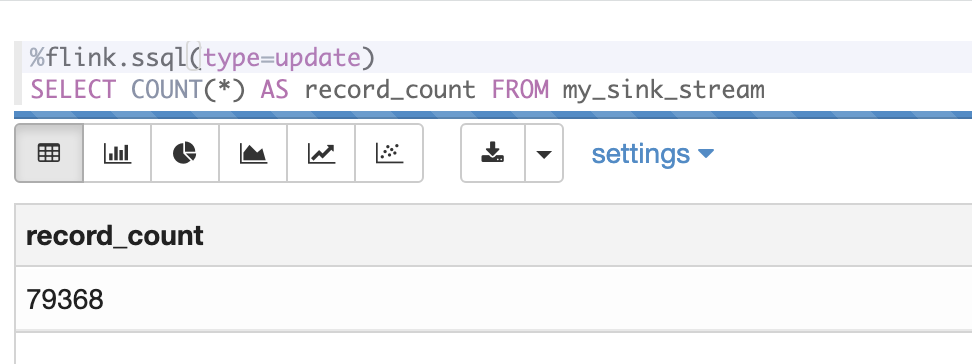
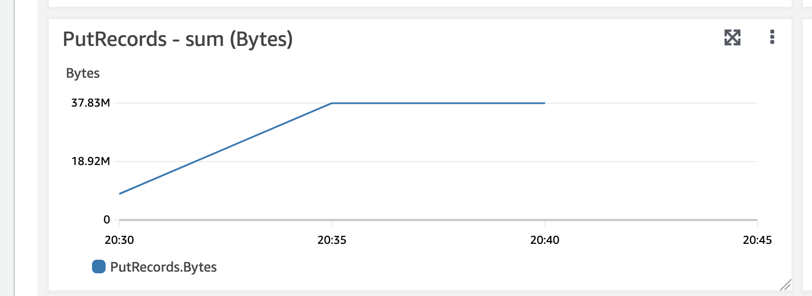

# Cross Region Replication of a Kinesis Data Stream using Kinesis Data Analytics Studio (Apache Flink SQL)

Using the Apache Flink SQL API to connect to a Kinesis Data Stream in Region A and writing the data into Region B for the purposes of cross region replication


## Description

It can be desirable to replicate data from a Kinesis Data Stream in *Region A* to *Region B* for many reasons including Disaster Recovery Resiliency, migration to another region, or simply making data available in both regions for separation of concerns. 

In this code repository, we showcase how to replicate data between regions using [Kinesis Data Analytics Studio](https://docs.aws.amazon.com/kinesisanalytics/latest/java/how-notebook.html), a managed Apache Flink SQL interactive environment using Apache Zeppelin.

## Getting Started

### Dependencies

- [Active Amazon Web Service Account](https://aws.amazon.com/)
- [Python 3.x](https://www.python.org/downloads/) for Data Generation
  - Python Dependencies required:
    - json
    - datetime
    - [boto3](https://pypi.org/project/boto3/)
    - [Faker](https://pypi.org/project/Faker/)
### Installing

1. Clone this repository
2. [Create a Kinesis Data Stream](https://docs.aws.amazon.com/streams/latest/dev/how-do-i-create-a-stream.html) in Region A 
3. [Create a Kinesis Data Stream](https://docs.aws.amazon.com/streams/latest/dev/how-do-i-create-a-stream.html) in Region B
4. [Create a Kinesis Data Analytics Studio application](https://docs.aws.amazon.com/kinesisanalytics/latest/java/how-zeppelin-creating.html) and use the default create wizard
5. Add the following permissions to your Kinesis Data Analytics Studio role:
```json
   "glue:CreateTable",
   "glue:GetTables",
   "glue:GetPartitions",
   "kinesis:ListShards",
   "kinesis:PutRecords",
   "kinesis:GetShardIterator",
   "glue:DeleteTable",
   "glue:GetDatabases",
   "glue:GetTable",
   "glue:GetDatabase",
   "kinesis:PutRecord",
   "glue:GetPartition",
   "kinesis:GetRecords"
```
7. Click on "Run" for the Kinesis Data Analytics Studio application and wait a few moments for the application to start.
6. Open the Kinesis Data Analytics Studio application in Apache Zeppelin, and import the [replicator.zpln](replicator.zpln) file.
7. Follow the instructions in the notebook (Github preview [here](replicator.ipynb)) in order to begin replicating data to the secondary region.

## Executing program

### Insert records into secondary region stream


### Count records that have landed in secondary stream


### PutRecords Metric showcasing data arriving in secondary stream

### Sending Data
In order to start sending data to your **SOURCE** stream, download [send_data.py](send_data.py) and run the file using the following command:

```bash
python send_data.py
```

NOTE: Ensure you have modified the file to mention your source stream name and the correct region. It will default to the user you are using to execute the python script from your machine.

### Replication
Run each paragraph in the included Apache Zeppelin notebook (`replicator.zpln`) by clicking the Play button on the top right of each paragraph, or by typing <kbd>SHIFT</kbd> + <kbd> ENTER</kbd>

## Testing
You can use the provided zeppelin notebook's last paragraph to verify that data is being replicated across regions to your secondary kinesis data stream. This will perform a `COUNT(*)` of all records written to the stream starting from the earliest offset. 

You can also review the Kinesis Data Stream incoming records metric on your destination stream to ensure that data is being delivered in a timely manner.


## Note
Despite being browser-based, you can close this Apache Zeppelin notebook at any time and the Kinesis Data Analytics application will continue to replicate data unless the Kinesis Data Analytics application is stopped via the Amazon Web Services Management Console or API.

Additionally, this repository *does not* cover several important aspects of replication including [scaling of your Kinesis Data Analytics application](https://github.com/aws-samples/kda-flink-app-autoscaling). Be sure to give thought to these aspects of replication before deploying this solution into a streaming environment.
## Help

Ensure you are stopping any superfluous paragraphs that don't need to be running to ensure your Kinesis Data Analytics application has enough available Kinesis Processing Units available to perform the replication.

## Authors

 [](https://github.com/jeremyber-aws) Jeremy Ber
## Version History

* 0.1
    * Initial Release